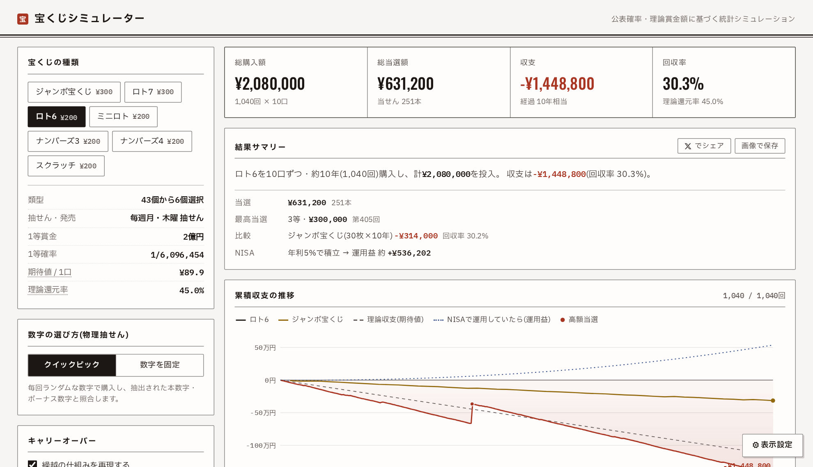

# 宝くじシミュレーター

公表確率・理論賞金額に基づく、日本の宝くじの統計シミュレーター。
[Claude Design](https://claude.ai/design) で作られた HTML/CSS/JS プロトタイプを
**Vite + React 19 + TypeScript** へ移植し、その後 UI を「印刷物・宝くじ券面」の
意匠へ全面刷新したもの。デザインの方針は `PRODUCT.md` を参照。



## 機能

- **7種**: ジャンボ宝くじ(年末ジャンボ型)・ロト7・ロト6・ミニロト・ナンバーズ3/4・スクラッチ
  公表確率と理論賞金額(キャリーオーバーなしの代表値)に基づく
- **ロト系の物理抽せん**: 毎回 本数字+ボーナス数字を実際に抽出して照合
  - クイックピック / 数字を固定(マークシートで選択・おまかせ)
  - 当せん口数での**パリミュチュエル山分け**(同一数字の複数口は1等総額が増えず、当せん本数の少ない等級も希釈)
- **キャリーオーバー**(ロト6・ロト7): 全国1等不出現時に繰越・上限あり
- **ジャンボのバラ/連番**(10枚1セット、7等確定・連番は1等+前後賞同時)
- **ナンバーズの申込タイプ**: ストレート / ボックス / セット
- **3つの実行モード**: 一括実行 / 連続購入アニメーション(速度4段階) / 1等が出るまで回す(チェイス)
- **比較モード**: もう1種を同じ時間軸で同期並走(期間・購入数を独立指定可)
- **モンテカルロ統計**: 同条件を30/100/300回繰り返した最終収支の分布(ヒストグラム)
- **NISA参照線**: 同額を年利%で積立運用した複利の運用益。超長期は命数法(恒河沙・無量大数…)〜指数表記
- **収支グラフ**: 累積収支の折れ線・理論収支線・高額当選マーカー・クロスヘア+ツールチップ(理論比/年換算)・
  最大ドローダウン区間・最高/最低点の付箋・結果確定時の描き込みアニメーション
- **結果サマリー + シェア画像(PNG)**、**設定のURL/localStorage保存**

## デザイン

**印刷物・宝くじ券面**(紙白×墨罫×朱)。ガラス・グロー・ぼかしは使わない。

- 構造は罫線(子持ち罫・表罫)で作る。パネルは不透明な帳票面
- **黒字=墨 / 赤字=朱**(帳簿の朱記)。当せんも朱(判子・スタンプ演出)
- NISA参照線は藍(帳簿の青ペン)、比較系列は金茶
- 数字: KPI は Oswald(券面の組番)、表とログは IBM Plex Mono、本文は IBM Plex Sans JP
- ライト(紙白)/ダーク(夜の帳簿)。全トークンは WCAG AA を実測で担保
- アニメ中はアダプティブ再描画(重量パネルは150ms間隔、チャート/KPIは毎フレーム)

## 開発

```bash
bun install
bun run dev          # 開発サーバ (http://localhost:5173)
bun run build        # 型チェック + 本番ビルド (dist/)
bun run preview      # ビルド成果物のプレビュー
bun run typecheck    # 型チェックのみ
bun run lint         # oxlint
bun run lint:fix     # oxlint --fix
bun run format       # oxfmt(整形して書き込み)
bun run format:check # oxfmt --check(整形差分のチェックのみ)
bun run check        # format:check + lint + typecheck をまとめて
bun run smoke        # エンジン+データ定義の検証(組合せ論照合・還元率・メカニクス)
```

リンタは [oxlint](https://oxc.rs/docs/guide/usage/linter)(`.oxlintrc.json`、correctness カテゴリ + react/typescript/unicorn/oxc プラグイン)、
フォーマッタは [oxfmt](https://oxc.rs/)(`.oxfmtrc.json`、Prettier 互換設定: 幅120・セミコロンなし・シングルクォート・末尾カンマ)。
どちらも Rust 製で高速。

## デプロイ(Cloudflare Pages)

完全な静的SPA(サーバ機能・Pages Functions なし)。`wrangler.toml` に Pages 構成、`public/_headers`
にセキュリティヘッダー(CSP/HSTS相当)とハッシュ資産の不変キャッシュを置いてある。

### CLI で直接デプロイ

```bash
bunx wrangler login        # 初回のみ(ブラウザでCloudflare認証)
bun run deploy             # build → wrangler pages deploy(初回はプロジェクト名/本番ブランチを確認)
```

`bun run deploy` は `build && bunx wrangler pages deploy`。プロジェクト名は `wrangler.toml` の `name`
(既定 `lottery-sim`)。

### Git 連携で自動デプロイ(推奨)

Cloudflare ダッシュボードでリポジトリを接続し、ビルド設定を:

- **Build command**: `bun run build`
- **Build output directory**: `dist`

`public/_headers` はどちらの方法でも自動適用される。

### 公開ドメインが決まったら

OG/Twitter 画像は相対パス `og.png`(ルート配信で各SNSのクローラが解決可)。X カードを最も確実にするには、
独自ドメイン確定後に `index.html` の `og:image` / `twitter:image` を `https://<ドメイン>/og.png` の
絶対URLにすると堅実。`_headers` の CSP は初回デプロイ後に一度動作確認すること(フォント/スタイルが
崩れたら CSP が原因)。

## 構成

```
PRODUCT.md              デザイン方針(register/ペルソナ/アンチリファレンス/原則)
src/
  main.tsx              エントリ
  App.tsx               メインアプリ(状態・実行モード・レイアウト)
  styles.css            印刷意匠のスタイル(OKLCHトークン・罫線・スタンプ)
  types.ts              共有型定義
  lottery-data.ts       宝くじ定義・申込タイプ・フォーマット/集計/effGameOf
  sim-engine.ts         シミュレーションエンジン(UIなしの純ロジック: doDraw/runOneTrial/runBulkSim)
  sim.worker.ts         重いバッチ計算(一括・モンテカルロ)の Web Worker
  sim-runner.ts         メイン側API(ワーカープール並列 + 同期フォールバック)
  ErrorBoundary.tsx     ランタイム例外時のフォールバック
  components/
    charts.tsx          SVGチャート(収支折れ線・ヒストグラム・等級内訳・投資vs回収)
    features.tsx        プリセット・結果サマリー・シェア画像・命数法
    stats.tsx           モンテカルロ統計パネル
  tweaks/
    TweaksPanel.tsx     表示設定パネル(テーマ/アクセント/グラフ/NISA/ハイライト基準)
scripts/
  smoke.ts              検証スイート(集計整合・組合せ論・パリミュチュエル・複利)
```

## 移植の注記

- プロトタイプはブラウザ内 Babel + `window` グローバル + React 18 UMD で動いていた。
  移植版は ES モジュール + 型付けに置き換え、シミュレーションの計算ロジックは1:1で維持している。
- **データ修正1件**: ミニロト4等の当せん本数はプロトタイプで3,000本だったが、
  組合せ論 C(5,3)×C(26,2)=3,250本(公式の約1/52)が正しいため修正済み。
  `scripts/smoke.ts` が全等級を組合せ論と照合するため、同種の不整合は自動検出される。
- Tweaks パネルは元々デザインツールのホストプロトコル(`postMessage`)連携だったが、
  スタンドアロン用に **localStorage 永続化 + 画面内トグル(⚙ 表示設定)** へ差し替えた。

## ライセンス

[Mozilla Public License 2.0](LICENSE)(MPL-2.0)。ファイル単位の弱コピーレフトで、
改変したファイルは同ライセンスでの公開維持が必要ですが、プロプライエタリなコードとの
組合せ(Larger Work)は許容されます。

## 免責

娯楽・教育目的のシミュレーターです。確率・賞金は公表されている理論値(平均値)に基づき、
実際の結果を保証するものではありません。
